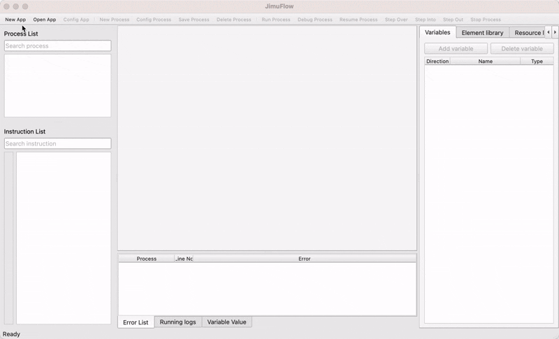

# JimuFlow

English | [中文](README.md)

JimuFlow is a simple and easy-to-use cross-platform RPA tool that allows you to develop and run RPA applications on Windows, Linux, and MacOS.

The currently supported commands are categorized as follows:

1. **Basic Commands**: Including process control, waiting, data processing, etc.
2. **Operating System Commands**: Including file operations, process management, clipboard operations, etc.
3. **Mouse and Keyboard Commands**: Used to simulate user mouse and keyboard operations.
4. **Data Table Commands**: Used to manipulate table data, supporting Excel and CSV formats.
5. **Web Automation Commands**: Used to operate browsers and web pages, supporting Windows, Linux, and MacOS.
6. **Windows Automation Commands**: Used to control windowed applications on Windows.

## Demo

## Installation

Please download the installation package from the project's release page for installation. For details, please refer to the [Installation Document](docs/en/manual/install.md).

## Build

If you want to build the application from source, please refer to the [Build Documentation](docs/zh/develop/build.md).

## Development

Please refer to the [Development Documentation](docs/zh/develop/readme.md).

## Contribution

You can contribute in the following ways:

- **Report Issues**: If you find any issues, please provide feedback through GitHub or Gitee Issues.
- **Submit PRs**: If you want to improve this project, please submit a Pull Request via GitHub or Gitee.

## License

This project is licensed under both the GNU General Public License (GPL) and a commercial license.

- Under the GPL license, you are free to use, modify, and distribute this software, but you must make the source code of any derivative works publicly available.
- If you wish to keep derivative works closed-source, please contact us to purchase a commercial license.

## Contact the Author

For questions related to the project code, please provide feedback directly through GitHub or Gitee Issues.

For other inquiries, you can contact me via:

- Email: [jimuflow@gmail.com](mailto:jimuflow@gmail.com)
