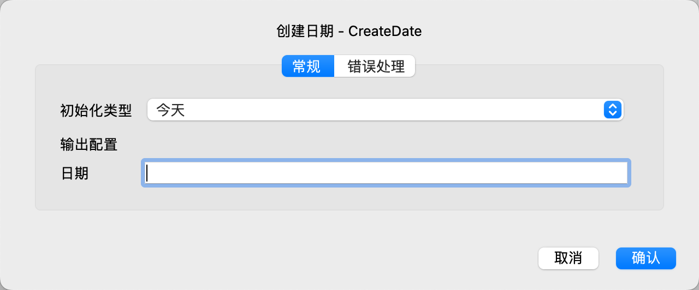

# 创建日期

创建一个日期变量，并初始化为指定的值。

## 指令配置

### 初始化类型

选择初始化类型，可选值有：今天、将时间戳转换为日期、解析日期字符串。

### 时间戳

如果初始化类型为将时间戳转换为日期，则输入时间戳。

时间戳是一个从1970 年 1 月 1 日 00:00:00 UTC 到当前时间的秒数，支持小数，小数部分将作为毫秒数。

### 日期字符串

如果初始化类型为解析日期字符串，则输入日期字符串。

### 日期格式

如果初始化类型为解析日期字符串，则输入日期时间格式。

关于日期格式的更多信息，请参考 [日期时间格式](create_date_time.md#_6)

### 日期

输入用于保存日期的变量名。
