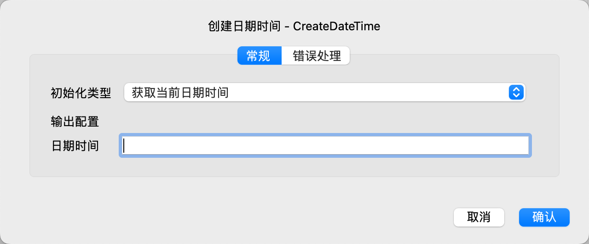

# 创建日期时间

创建一个日期时间变量，并初始化为指定的值。

## 指令配置

### 初始化类型

选择初始化类型，可选值有：获取当前日期时间、将时间戳转换为日期时间、解析日期时间字符串。

### 时间戳

如果初始化类型为将时间戳转换为日期时间，则输入时间戳。

时间戳是一个从1970 年 1 月 1 日 00:00:00 UTC 到当前时间的秒数，支持小数，小数部分将作为毫秒数。

### 日期时间字符串

如果初始化类型为解析日期时间字符串，则输入日期时间字符串。

### 日期时间格式

如果初始化类型为解析日期时间字符串，则输入日期时间格式。

日期格式串是一个由格式符号和普通字符组成的字符串，用于解析或生成日期时间字符串。

日期格式示例：

| 格式串                       | 匹配示例                                                   |
|:--------------------------|:-------------------------------------------------------|
| YYYY-MM-DD HH:mm:ss       | 2024-11-13 21:01:45                                    |
| YYYY-MM-DDTHH:mm:ss.SSSZZ | 2024-11-13T13:01:45.512Z、2024-11-13T21:01:45.512+08:00 |
| YYYY-MM-DD HH:mm:ssZZ     | 2024-11-13 13:01:45Z、2024-11-13 21:01:45+08:00     |

支持的格式符号如下：

|                | 符号   | 输出                                        |
|:---------------|:-----|:------------------------------------------|
| **年份**         | YYYY | 2000, 2001, 2002 ... 2012, 2013           |
|                | YY   | 00, 01, 02 ... 12, 13                     |
| **月份**         | MMMM | January, February, March ...              |
|                | MMM  | Jan, Feb, Mar ...                         |
|                | MM   | 01, 02, 03 ... 11, 12                     |
|                | M    | 1, 2, 3 ... 11, 12                        |
| **一年中的某一天**    | DDDD | 001, 002, 003 ... 364, 365                |
|                | DDD  | 1, 2, 3 ... 364, 365                      |
| **日期**         | DD   | 01, 02, 03 ... 30, 31                     |
|                | D    | 1, 2, 3 ... 30, 31                        |
|                | Do   | 1st, 2nd, 3rd ... 30th, 31st              |
| **星期几**        | dddd | Monday, Tuesday, Wednesday ...            |
|                | ddd  | Mon, Tue, Wed ...                         |
|                | d    | 1, 2, 3 ... 6, 7                          |
| **ISO周日期**     | W    | 2011-W05-4, 2019-W17                      |
| **小时**         | HH   | 00, 01, 02 ... 23, 24                     |
|                | H    | 0, 1, 2 ... 23, 24                        |
|                | hh   | 01, 02, 03 ... 11, 12                     |
|                | h    | 1, 2, 3 ... 11, 12                        |
| **AM / PM**    | A    | AM, PM, am, pm                            |
|                | a    | am, pm                                    |
| **分钟**         | mm   | 00, 01, 02 ... 58, 59                     |
|                | m    | 0, 1, 2 ... 58, 59                        |
| **秒**          | ss   | 00, 01, 02 ... 58, 59                     |
|                | s    | 0, 1, 2 ... 58, 59                        |
| **亚秒**         | S... | 0, 02, 003, 000006, 123123123123...       |
| **时区**         | ZZZ  | Asia/Baku, Europe/Warsaw, GMT ...         |
|                | ZZ   | -07:00, -06:00 ... +06:00, +07:00, +08, Z |
|                | Z    | -0700, -0600 ... +0600, +0700, +08, Z     |
| **时间戳（秒）**     | X    | 1381685817, 1381685817.915482 ...         |
| **时间戳（毫秒或微秒）** | x    | 1569980330813, 1569980330813221           |

如果需要将格式符号作为普通字符，则需要将格式符号放在左右中括号中，如“YYYY-MM-DD h [h] m”可以用于匹配"2024-11-13 8 h 40”。

### 日期时间

输入用于保存日期时间的变量名。
