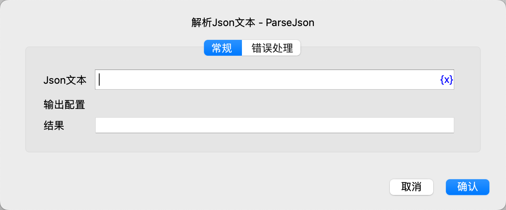

# 解析Json文本

将JSON文本解析为对应类型的流程对象，并保存到变量中。

## 指令配置

### Json文本

输入要解析的JSON文本。

### 结果

输入用于保存解析结果的变量名。

JSON类型和流程对象类型之间的对应关系：

| JSON类型 | 流程对象类型 | JSON示例                 |
|--------|--------|------------------------|
| 对象     | 字典     | {"name":"Tom","age":1} |
| 数组     | 列表     | [1,2,3]                |
| 字符串   | 文本     | "hello"                |
| 数字     | 数值     | 1.23                   |
| 布尔值   | 布尔值     | true、false             |
| null   | 空值     | null                   |

### 错误处理

如果指令执行出错，则执行错误处理，详情参见[指令的错误处理](../../../manual/error_handling.md)。
