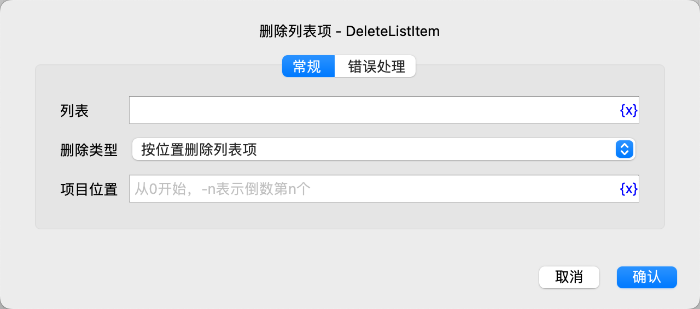

# 删除列表项

删除一个列表项。

## 指令配置

### 列表

选择列表对象。

### 删除类型

选择删除类型，可选值有：按位置删除列表项、按值删除列表项。

### 项目位置

如果选择了按位置删除列表项，则需要输入项目位置，从 0 开始，-n 表示倒数第 n 个位置。

### 项目值

如果选择了按值删除列表项，则需要输入项目值。

### 错误处理

如果指令执行出错，则执行错误处理，详情参见[指令的错误处理](../../../manual/error_handling.md)。
