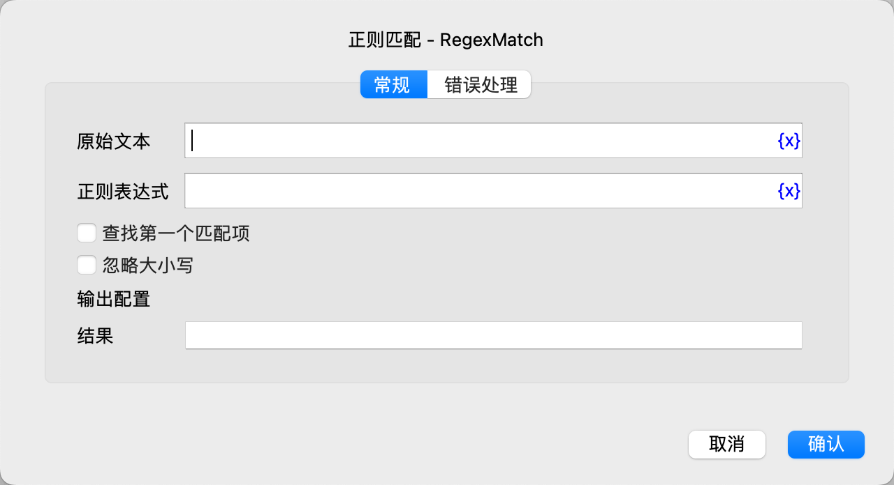

# 正则匹配

使用正则表达式查找匹配文本，并将查找结果保存到指定的变量中。

## 指令配置

### 原始文本

输入原始文本。

### 正则表达式

输入正则表达式。

### 查找第一个匹配项

选择是否只查找第一个匹配项。

### 忽略大小写

选择是否忽略大小写。

### 结果

输入用于保存查找结果的变量名。

如果选择了查找第一个匹配项，则结果变量的值为匹配项。否则，结果变量的值为匹配项列表。

### 错误处理

如果指令执行出错，则执行错误处理，详情参见[指令的错误处理](../../../manual/error_handling.md)。
