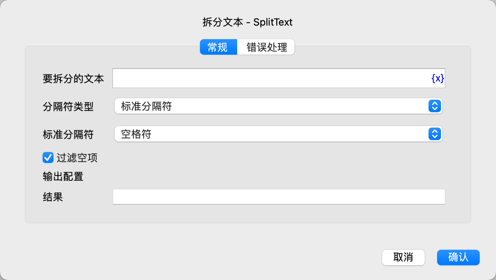

# 截取文本

从文本中截取指定范围的文本，并保存到变量中。

## 指令配置

### 原始文本

输入原始文本。

### 起始位置

选择起始位置，可选值有：从第一个字符开始、从指定位置开始、从指定文本开始。

### 起始字符位置

如果选择起始位置为从指定位置开始，则输入起始位置，从 0 开始，-n 表示倒数第 n 个字符。

### 起始文本内容

如果选择起始位置为从指定文本开始，则输入起始文本内容。

### 结束位置

选择结束位置，可选值有：到文本末尾、到指定长度。

### 截取长度

如果选择结束位置为到指定长度，则输入截取长度。

### 结果

输入用于保存截取结果的变量名。

### 错误处理

如果指令执行出错，则执行错误处理，详情参见[指令的错误处理](../../../manual/error_handling.md)。
