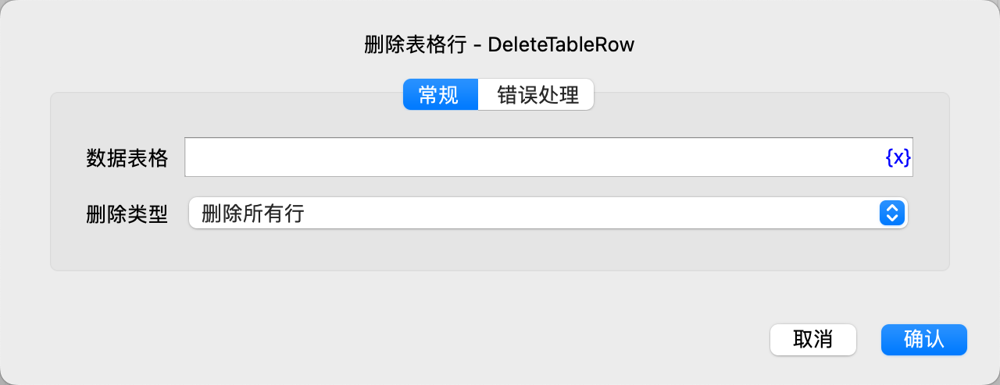

# 删除表格行

删除数据表格的一行数据。

## 指令配置

### 数据表格

选择要操作的数据表格。

### 删除类型

选择删除类型，可选项有：删除所有行、删除一行。

### 行号

如果选删除一行，则需要输入行号，行号从1开始，-n 表示倒数第n行。

### 错误处理

如果指令执行出错，则执行错误处理，详情参见[指令的错误处理](../../manual/error_handling.md)。
