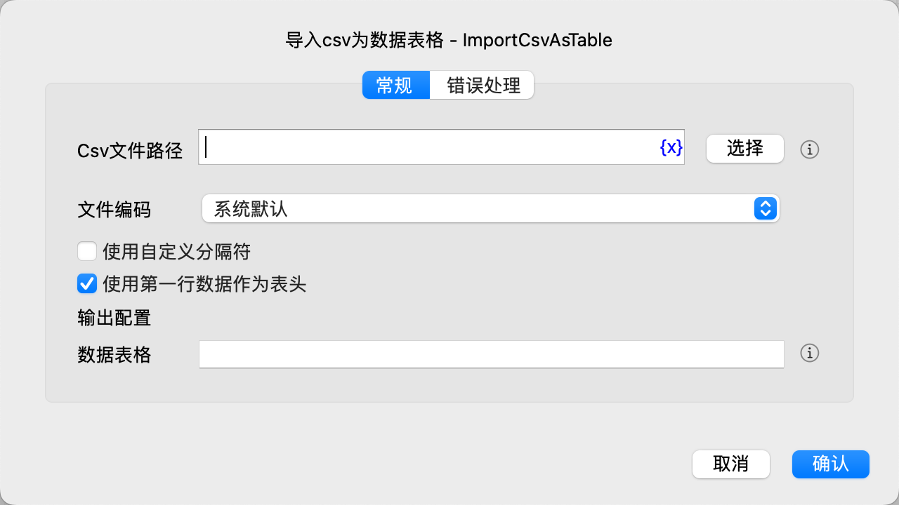

# 导入csv为数据表格

将csv文件导入为数据表格。

## 指令配置

### Csv文件路径

输入或选择Csv文件路径。

### 文件编码

选择文件编码。

### 使用自定义分隔符

选择是否使用自定义分隔符。

### 自定义分隔符

输入自定义分隔符。

### 使用第一行数据作为表头

选择是否使用第一行数据作为表头。

### 数据表格

输入用于保存数据表格的变量名。

### 错误处理

如果指令执行出错，则执行错误处理，详情参见[指令的错误处理](../../manual/error_handling.md)。
