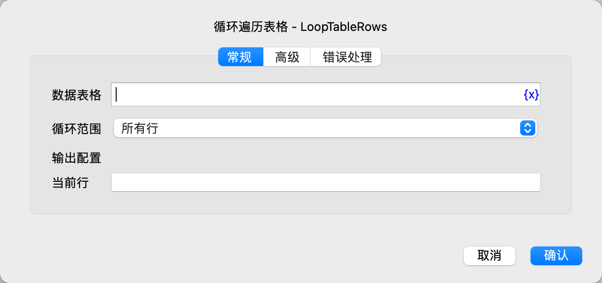
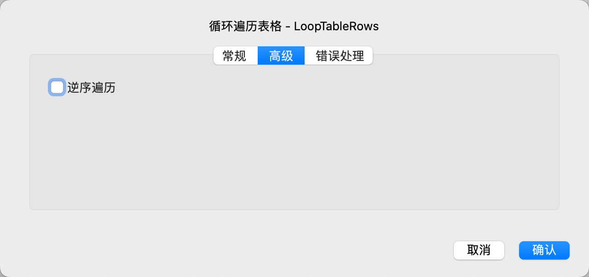

# 循环遍历表格

循环遍历表格的每一行数据，然后执行循环内的指令。

## 指令配置

### 数据表格

选择要遍历的数据表格。

### 循环范围

选择循环范围，可选项有：所有行、指定范围。

### 起始行号

如果遍历指定范围，则需要输入起始行号，从1开始，-n表示倒数第n行。

### 结束行号

如果遍历指定范围，则需要输入结束行号，从1开始，-n表示倒数第n行。

### 当前行

输入用于保存当前行的变量名，用于后续指令使用。

### 逆序遍历

选择是否逆序遍历。

### 错误处理

如果指令执行出错，则执行错误处理，详情参见[指令的错误处理](../../manual/error_handling.md)。
