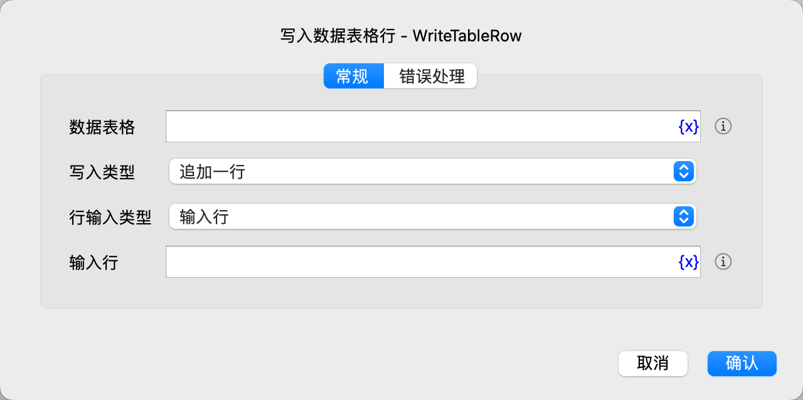

# 写入数据表格行

向数据表格中写入一行数据。

## 指令配置

### 数据表格

选择要操作的数据表格。

### 写入类型

选择写入类型，可选项有：追加一行、插入一行、更新一行。

### 行号

如果选择插入或更新，则需要输入行号，从1开始，-n表示倒数第n行。。

### 行输入类型

选择输入行数据的类型，可以选择：

* 输入行：直接输入包含行数据的列表。
* 输入列：输入行数据的每一列数据。

### 输入行

输入要写入的数据行，该数据行必须是一个列表，列表中的值代表每一列的数据。

### 输入列

输入数据行的每一列数据。

### 错误处理

如果指令执行出错，则执行错误处理，详情参见[指令的错误处理](../../manual/error_handling.md)。
