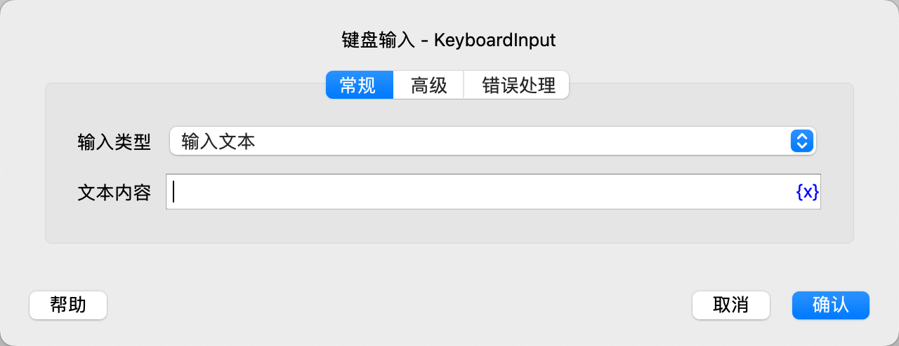
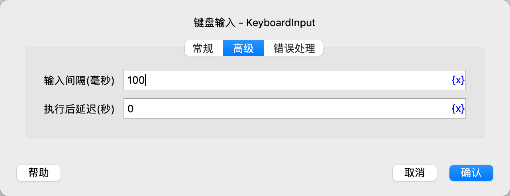

# 键盘输入

通过键盘输入文本或快捷键。

## 指令配置

### 输入类型

选择输入类型，可选值有输入文本、输入快捷键。

### 文本内容

如果选择输入文本，则需要填写要输入的文本内容。

注意：在Windows中支持中英文等所有Unicode字符，在Linux和MacOS中只支持英文字符。如果你需要在在Linux和MacOS中输入非英文字符，
请使用[设置剪贴板文本指令](../OperatingSystem/set_clipboard_text.md)和粘贴快捷键实现。

### 快捷键类型

如果选择输入快捷键，则需要选择快捷键类型，可选值有：常用快捷键、自定义快捷键。

### 常用快捷键

选择常用快捷键，可选值有：

* Ctrl/Cmd+C
* Ctrl/Cmd+V
* Ctrl/Cmd+X
* Ctrl/Cmd+Z
* Ctrl/Cmd+S
* Ctrl/Cmd+A
* Enter

“Ctrl/Cmd”按键在Windows、Linux中为Ctrl按键，在MacOs中为Command按键。

### 自定义快捷键

逐个配置快捷键的每个按键。

### 输入间隔

输入文本时每次输入之间的间隔时间，默认100毫秒。

### 执行后延迟

执行指令后，延迟一段时间再继续执行后续指令，单位为秒。

### 错误处理

如果指令执行出错，则执行错误处理，详情参见[指令的错误处理](../../manual/error_handling.md)。
