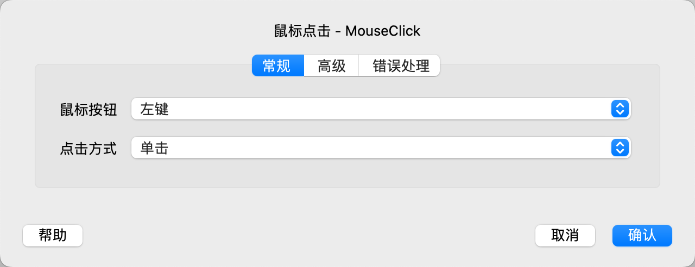
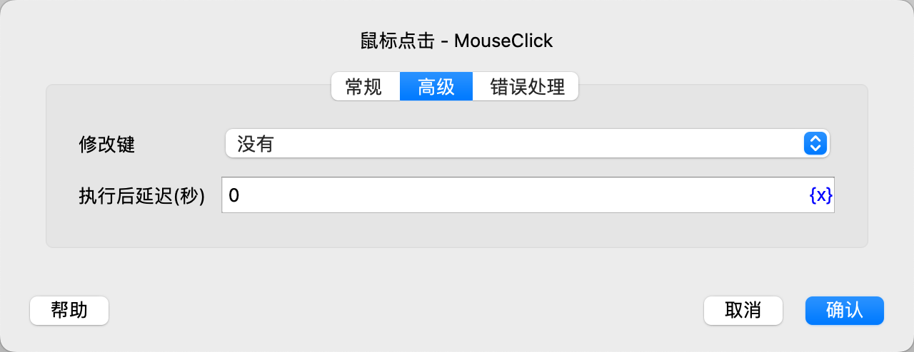

# 鼠标点击

点击鼠标指定按钮。

## 指令配置

### 鼠标按钮

选择要点击的鼠标按钮，可选值有左键、右键、中键。

### 点击方式

选择点击方式，可选值有单击、双击、鼠标按下、鼠标弹起。

### 修改键

选择点击鼠标时同时按下的键盘按键，可选值有：没有、Alt、Ctrl、Ctrl或Meta（根据操作系统自动选择，MacOS为Meta，其他OS为Ctrl）、Meta、Shift。

### 执行后延迟

执行指令后，延迟一段时间再继续执行后续指令，单位为秒。

### 错误处理

如果指令执行出错，则执行错误处理，详情参见[指令的错误处理](../../manual/error_handling.md)。
