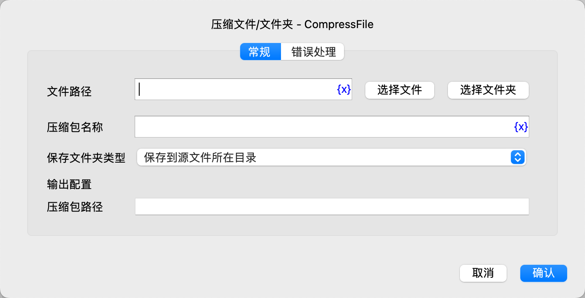

# 压缩文件/文件夹

将文件或文件夹压缩成zip压缩包文件。

## 指令配置

### 文件路径

输入或选择要压缩的文件或文件夹路径。

### 压缩包名称

输入压缩包名称，不需要带扩展名。

### 保存文件夹类型

* 保存到源文件所在目录
* 保存到指定文件夹

### 保存文件夹

如果选择保存到指定文件夹，则需要输入或选择保存文件夹路径。

### 压缩包路径

输入用于保存压缩包文件路径的变量名。

### 错误处理

如果指令执行出错，则执行错误处理，详情参见[指令的错误处理](../../manual/error_handling.md)。
