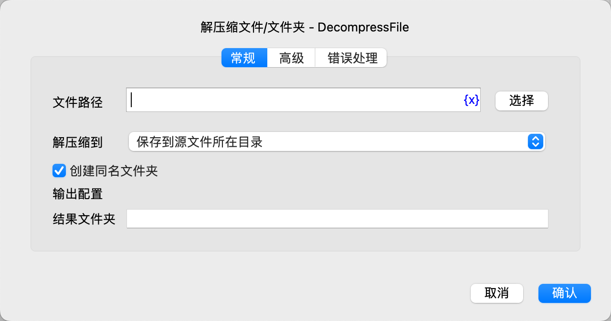
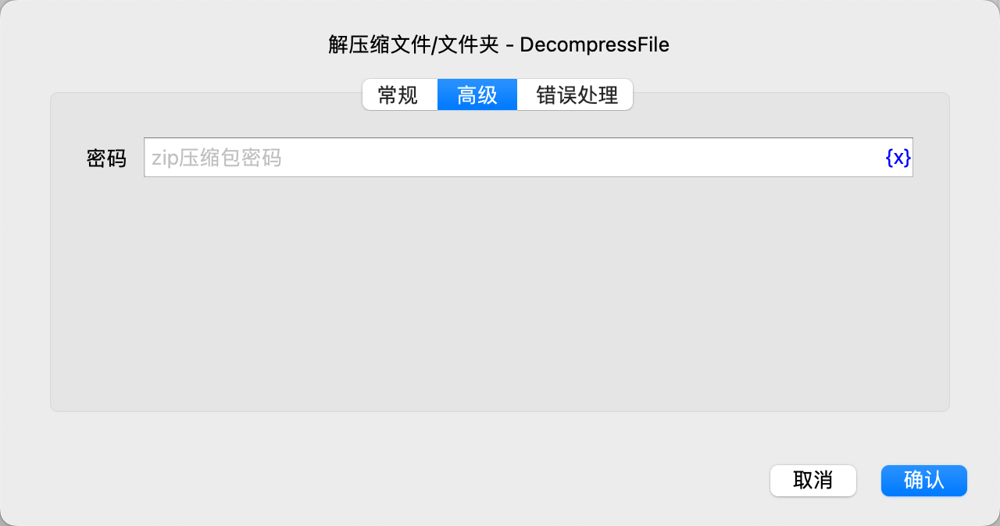

# 解压缩文件/文件夹

将zip压缩包解压到指定文件夹。

## 指令配置

### 文件路径

输入或选择zip压缩包文件路径。

### 解压缩到

* 保存到源文件所在目录
* 保存到指定文件夹

### 保存文件夹

如果选择保存到指定文件夹，则需要输入或选择保存文件夹路径。

### 创建同名文件夹

是否在目标文件夹中创建一个与压缩包同名的文件夹，然后将压缩包解压到该文件夹中。

### 结果文件夹

输入用于保存压缩包解压路径的变量名。

### 密码

输入压缩包密码。

### 错误处理

如果指令执行出错，则执行错误处理，详情参见[指令的错误处理](../../manual/error_handling.md)。
