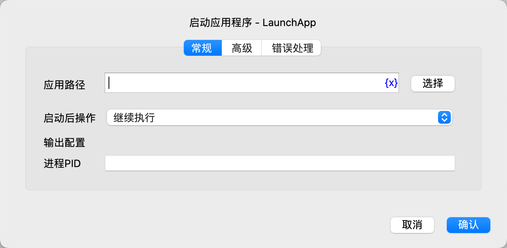
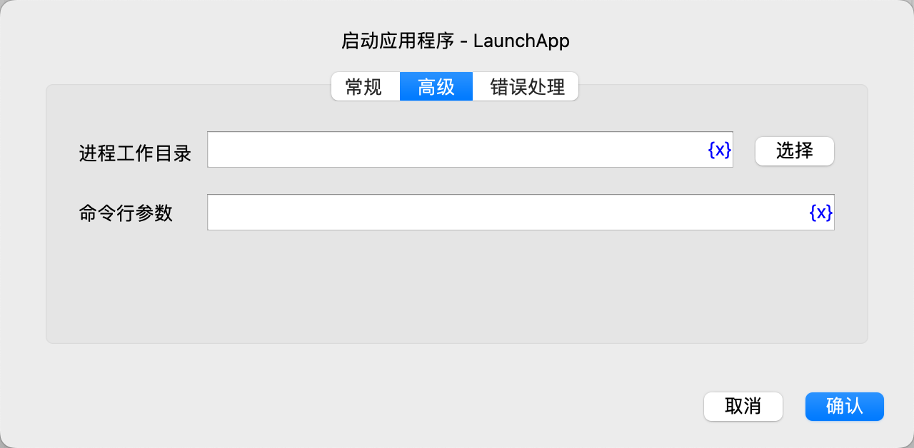

# 启动应用程序

启动应用程序。

## 指令配置

### 应用路径

输入或选择要启动的应用程序路径。

### 启动后操作

选择启动应用后的操作，可以选择：
* 继续执行：继续执行后续指令。
* 等待应用程序执行完成：等待应用执行完成，然后继续执行后续指令。

### 进程PID

输入用于保存进程PID的变量名称。

### 进程工作目录

输入或选择要启动的应用程序工作目录。

### 命令行参数

输入要传递给应用程序的命令行参数。

### 错误处理

如果指令执行出错，则执行错误处理，详情参见[指令的错误处理](../../manual/error_handling.md)。
