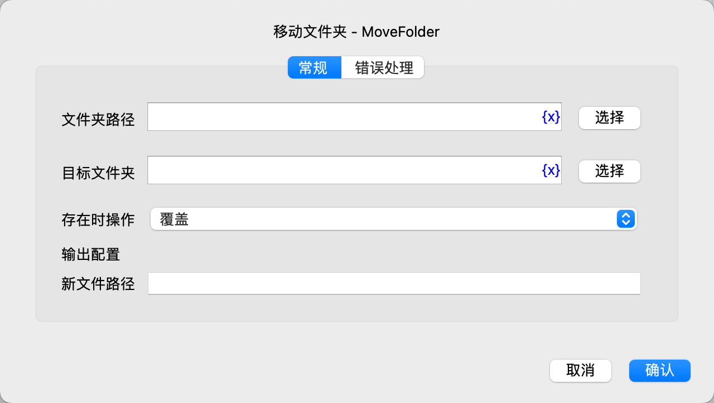

# 移动文件夹

移动文件夹。

## 指令配置

### 文件夹路径

输入或选择要移动的文件夹路径。

### 目标文件夹

输入或选择要移动到的目标文件夹。

### 存在时操作

如果移动到的新文件夹路径已存在，可以选择执行如下操作：

* 覆盖
* 自动重命名
* 执行错误处理

### 新文件夹路径

输入用于保存新文件夹路径的变量名。

### 错误处理

如果指令执行出错，则执行错误处理，详情参见[指令的错误处理](../../manual/error_handling.md)。
