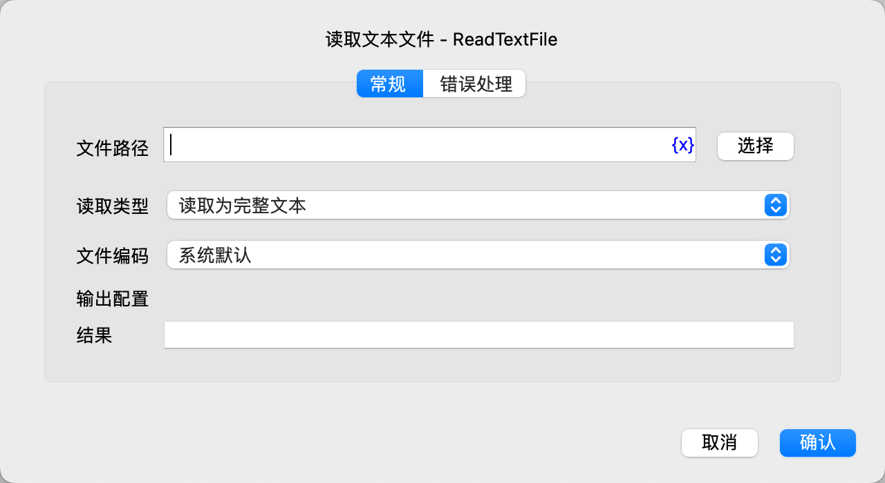

# 读取文本文件

读取文本文件。

## 指令配置

### 文件路径

输入或选择文本文件的路径。

### 读取类型

选择读取类型，可选值有：读取为完整文本、读取为行列表。

### 文件编码

选择文件编码。

### 结果

输入用于保存读取结果的变量名。

### 错误处理

如果指令执行出错，则执行错误处理，详情参见[指令的错误处理](../../manual/error_handling.md)。
