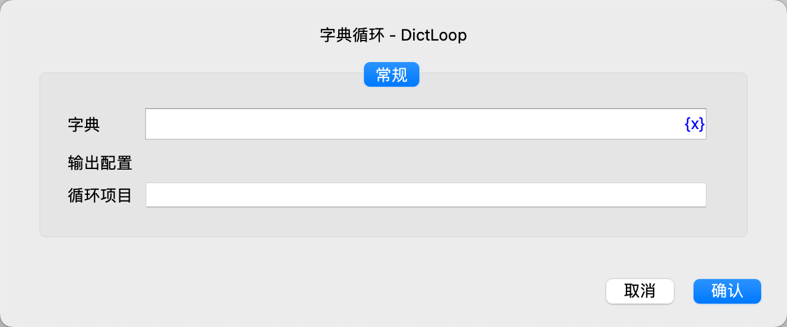
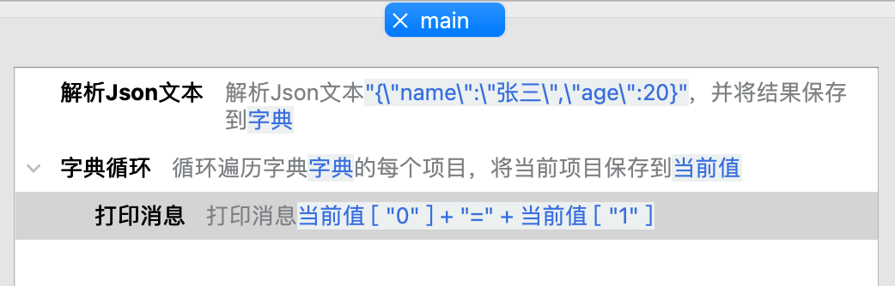
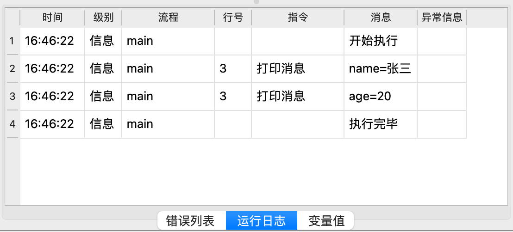

# 字典循环

循环遍历字典中的每一个键值对，然后执行循环内的指令。

## 指令配置

### 字典

输入需要遍历的字典表达式。

### 循环项目

输入用于保存字典中键值对的变量名，每一个键值对都是一个列表，其中第一个元素是键，第二个元素是值。

## 使用示例

该流程的执行逻辑如下：

1. 解析JSON字典数据，并保存到变量“字典”中。
2. 循环遍历“字典”中的每个键值对，将当前键值对保存到变量“当前值”，然后执行循环内的指令。
    1. 打印键值对的键和值。

运行日志：

