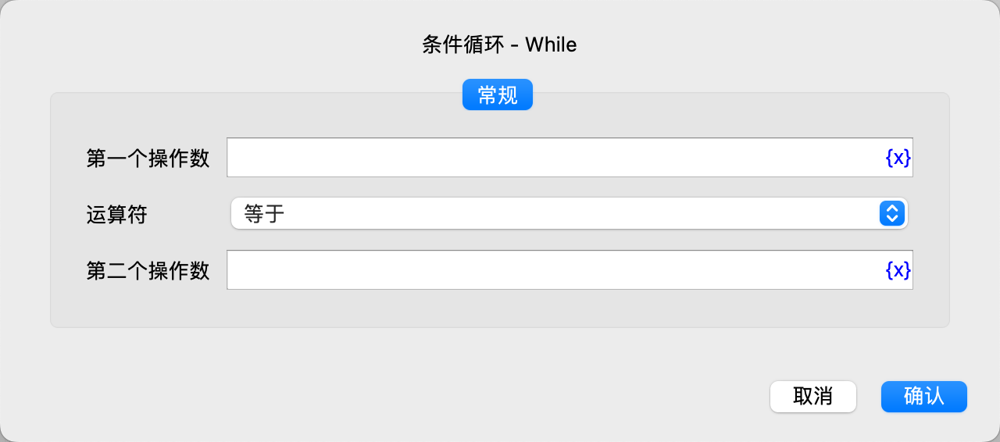
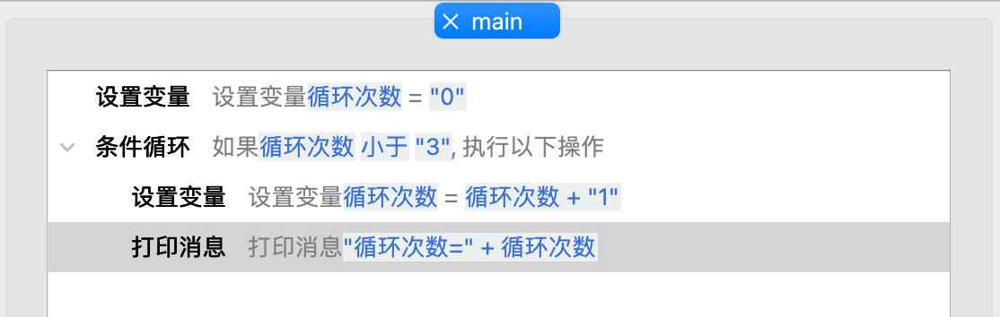
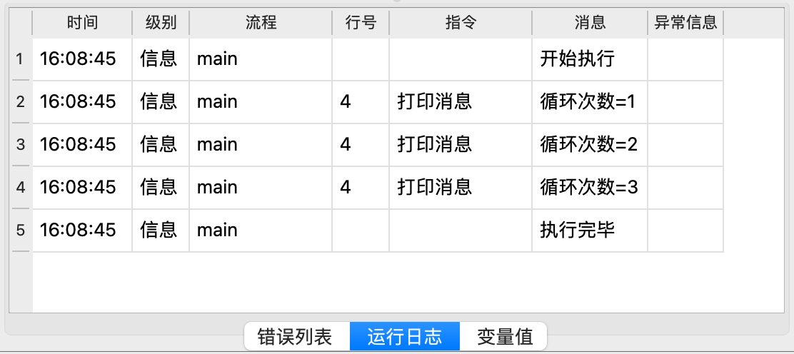

# 条件循环

判断指定的条件是否满足，如果满足，则重复执行包含的指令，直到不满足为止。

## 指令配置

### 第一个操作数

输入第一个操作数的表达式，如变量、字符串、数值等。

### 运算符

选择使用的比较运算符，当前支持如下运算符：等于、不等于、大于、小于、大于等于、小于等于、包含、不包含、为空、不为空、开头为、开头不为、结尾为、结尾不为。

### 第二个操作数

除了为空、不为空，其他运算符还需要输入第二个操作数。

## 使用示例

该流程的执行逻辑如下：

1. 设置变量“循环次数”，并赋值为0。
2. 如果“循环次数”小于3，则重复执行下面的指令。
    1. “循环次数”加1
    2. 打印循环次数

运行日志：

