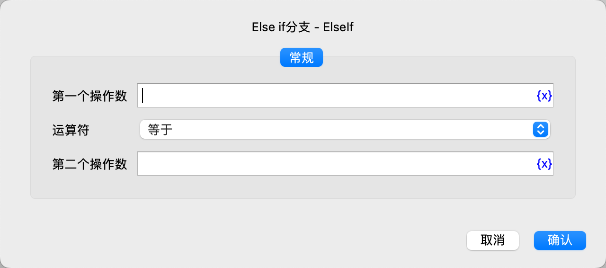
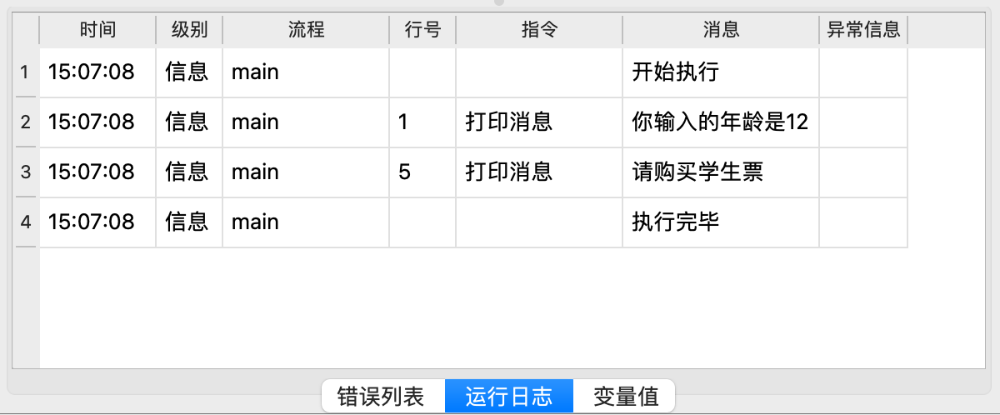

# Else If 分支

与If分支或其他Else If分支组合使用，当之前的条件分支均不满足时，继续判断当前分支条件是否满足，如果满足，则执行包含的所有指令。

## 指令配置

### 第一个操作数

输入第一个操作数的表达式，如变量、字符串、数值等。

### 运算符

选择使用的比较运算符，当前支持如下运算符：等于、不等于、大于、小于、大于等于、小于等于、包含、不包含、为空、不为空、开头为、开头不为、结尾为、结尾不为。

### 第二个操作数

除了为空、不为空，其他运算符还需要输入第二个操作数。

## 使用示例

该流程的执行逻辑如下：

1. 打印输入的年龄。
2. 判断年龄是否小于6，如果是，则打印消息“可以免票”。
3. 否则，继续判断年龄是否小于18，如果是，则打印消息“请购买学生票”。
4. 否则，打印消息“请购买成人票”。

运行日志：

