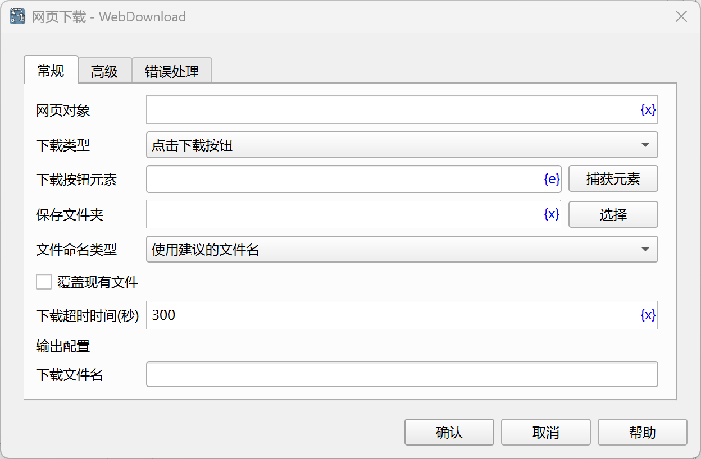
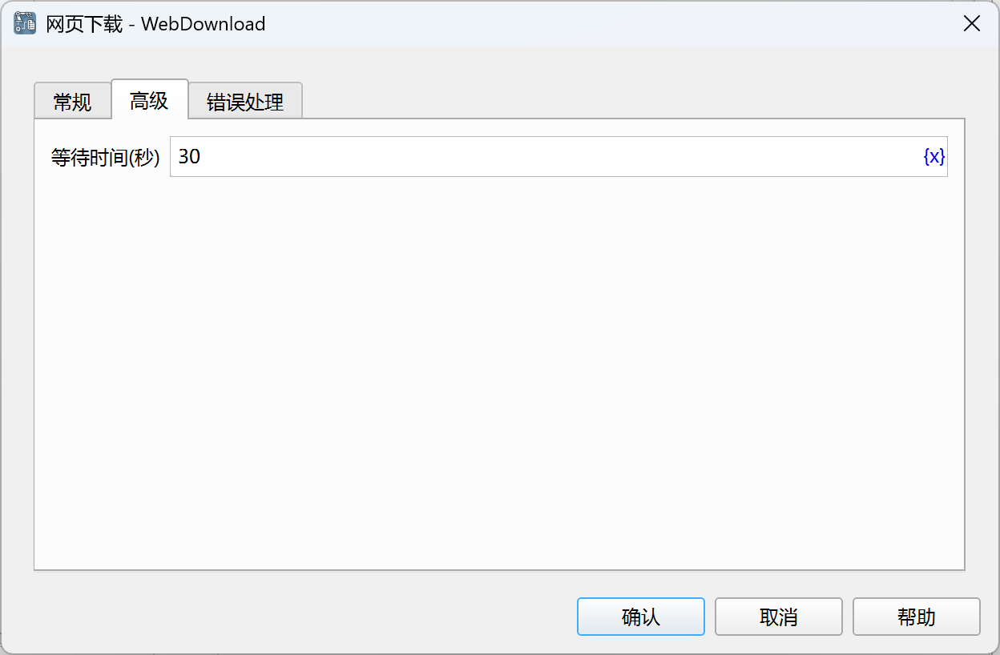

# 网页下载

下载网页文件。

## 指令配置

### 网页对象

选择要操作的网页对象。

### 下载类型

- 点击下载按钮：通过点击按钮下载。
- 打开下载链接：直接在浏览器中打开下载链接。

### 下载按钮元素

从元素库中选择一个网页元素，或者点击“捕获元素”按钮调用工具获取，详情请参见[网页元素捕获工具](../../../manual/web_element_capture_tool.md)。

### 下载地址

如果选择打开下载链接，则需要输入下载文件的链接地址。

### 保存文件夹

输入或选择保存下载文件的文件夹路径。

### 文件命名类型

选择文件命名方式，使用建议的文件名或者自定义文件名。

### 自定义文件名

如果选择自定义文件名，则输入自定义文件名。

### 覆盖现有文件

选择是否覆盖同名文件。

### 下载超时时间

输入下载超时时间，单位为秒。

### 下载文件名

输入用于保存下载文件路径的变量名。

### 等待时间

等待下载按钮或下载对话框出现的时间，单位为秒。

### 错误处理

如果指令执行出错，则执行错误处理，详情参见[指令的错误处理](../../../manual/error_handling.md)。
