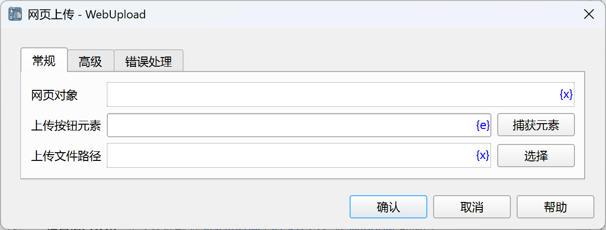
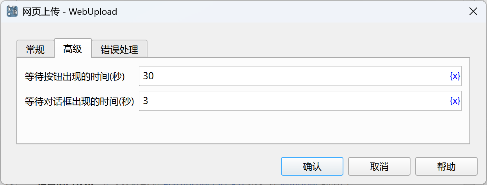

# 网页上传

通过网页上传文件。

## 指令配置

### 网页对象

选择要操作的网页对象。

### 上传按钮元素

从元素库中选择一个网页元素，或者点击“捕获元素”按钮调用工具获取，详情请参见[网页元素捕获工具](../../../manual/web_element_capture_tool.md)。

### 上传文件路径

输入或选择要上传的文件路径。

### 等待按钮出现的时间

等待上传按钮出现的时间，单位为秒。

### 等待对话框出现的时间

等待上传文件对话框出现的时间，单位为秒。

### 错误处理

如果指令执行出错，则执行错误处理，详情参见[指令的错误处理](../../../manual/error_handling.md)。
