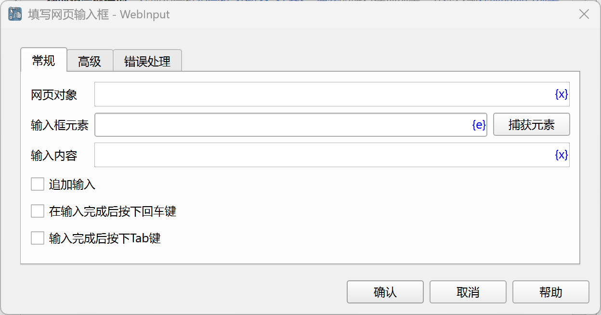
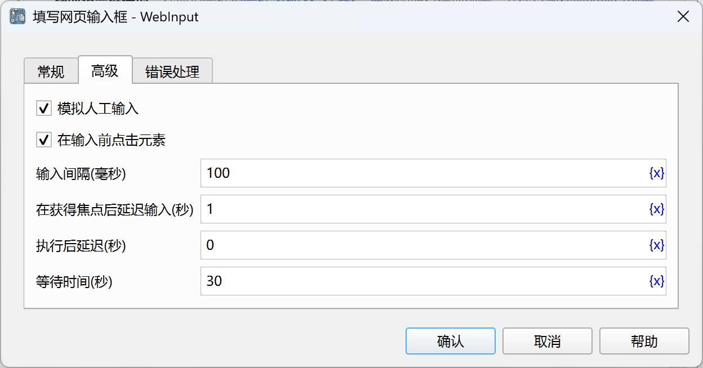

# 填写网页输入框

填写网页上的输入框。

## 指令配置

### 网页对象

选择要操作的网页对象。

### 输入框元素

从元素库中选择一个网页输入框元素，或者点击“捕获元素”按钮调用工具获取，详情请参见[网页元素捕获工具](../../../manual/web_element_capture_tool.md)。

### 输入内容

输入要填写的内容。

### 追加输入

如果勾选，则在原有输入内容上追加输入内容，否则，则覆盖原有输入内容。

### 在输入完成后按下回车键

如果勾选，则在输入完成后，再按下回车键。

### 输入完成后按下Tab键

如果勾选，则在输入完成后，再按下Tab键。

### 模拟人工输入

如果勾选，则Xpath定位的数据框必须是单个元素，且必须是可见的，没有被遮挡，且处于启用状态。

### 在输入前点击元素

如果勾选，则在输入前，先点击指定的元素。

### 输入间隔

输入之间的时间间隔，单位为毫秒。

### 在获得焦点后延迟输入

在获得焦点后，延迟一段时间再输入，单位为秒。

### 执行后延迟

执行指令后，延迟一段时间再继续执行后续指令，单位为秒。

### 等待时间

等待输入框出现的时间，单位为秒。

### 错误处理

如果指令执行出错，则执行错误处理，详情参见[指令的错误处理](../../../manual/error_handling.md)。
