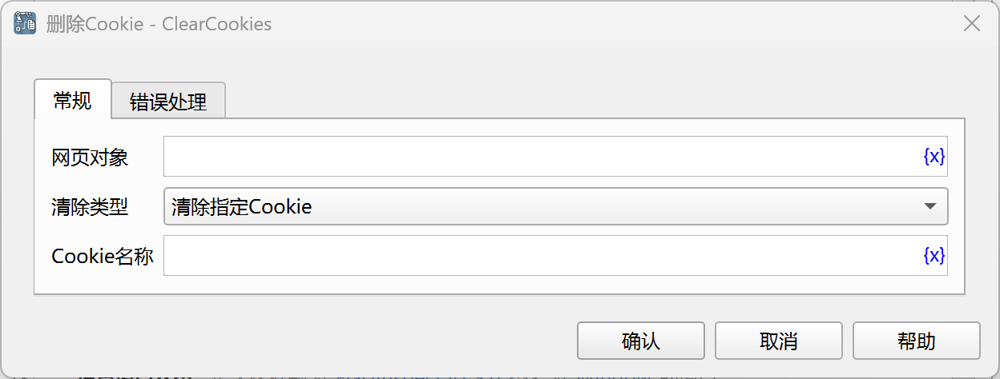

# 删除Cookie

删除网页Cookie。

## 指令配置

### 网页对象

选择要删除Cookie的网页对象。

### 清除类型

可以删除指定Cookie，或者清除所有Cookie。

### Cookie名称

输入要删除的Cookie名称。

### 错误处理

如果指令执行出错，则执行错误处理，详情参见[指令的错误处理](../../../manual/error_handling.md)。
