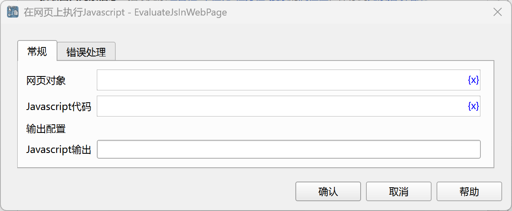

# 在网页上执行Javascript

在网页上执行JS代码，然后将返回的结果保存到流程变量中。

## 指令配置

### 网页对象

选择要执行JS代码的网页对象。

### Javascript代码

输入JS代码。

### Javascript输出

输入用于保存JS代码返回结果的变量名。

### 错误处理

如果指令执行出错，则执行错误处理，详情参见[指令的错误处理](../../../manual/error_handling.md)。
