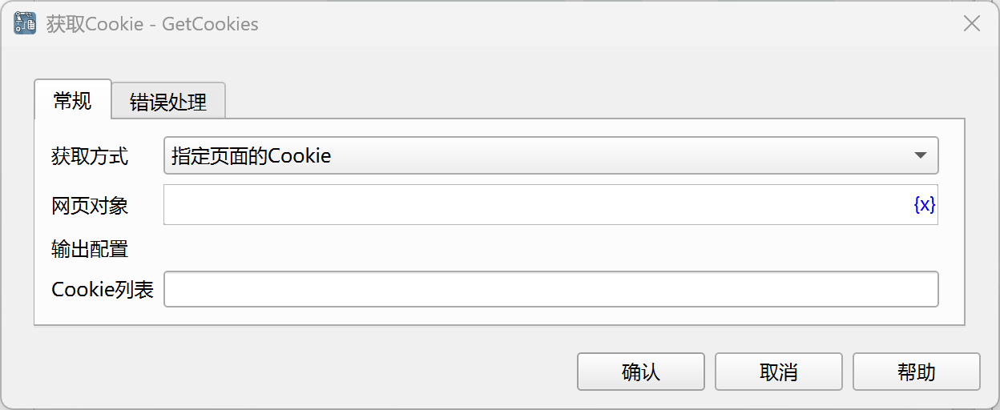

# 获取Cookie

获取网页Cookie。

## 指令配置

### 获取方式

可以获取指定页面的Cookie，也可以获取指定链接的Cookie。

### 网页对象

选择要获取Cookie的网页对象。

### 网页地址

选择要获取Cookie的网页地址。

### Cookie列表

输入用于保存Cookie列表的变量名。

Cookie列表由Cookie字典对象组成，Cookie字典对象的字段参见[设置Cookie](set_cookies.md#cookies)。

### 错误处理

如果指令执行出错，则执行错误处理，详情参见[指令的错误处理](../../../manual/error_handling.md)。
