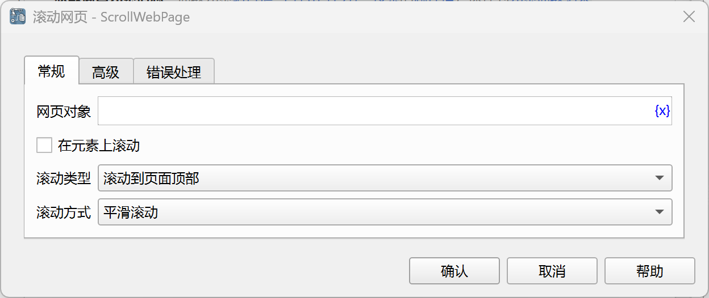
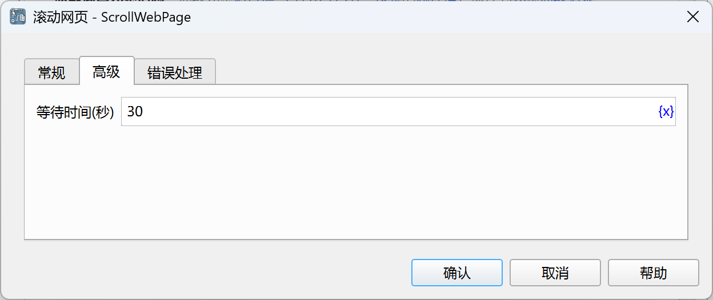

# 滚动网页

在网页上执行滚动操作。

## 指令配置

### 网页对象

选择要滚动的网页对象。

### 在元素上滚动

可以选择在网页元素上滚动，而不是滚动整个网页。

### 滚动元素

从元素库中选择一个网页元素，或者点击“捕获元素”按钮调用工具获取，详情请参见[网页元素捕获工具](../../../manual/web_element_capture_tool.md)。

### 当元素不可滚动时向上查找可滚动元素

如果元素不可滚动，则向上查找第一个可滚动的祖先元素。

### 滚动类型

滚动类型，可以选择：滚动到顶部、滚动到底部、滚动一屏、滚动到指定元素。

### 滚动次数

如果选择滚动一屏，则需要输入滚动的次数，正数向下滚动，负数向上滚动。

### 滚动间隔

如果选择滚动一屏，则需要输入每次滚动之间的间隔时间，单位为秒。

### 滚动到元素

从元素库中选择一个网页元素，或者点击“捕获元素”按钮调用工具获取，详情请参见[网页元素捕获工具](../../../manual/web_element_capture_tool.md)。

### 滚动方式

滚动方式，可以选择：平衡滚动、瞬间滚动。

### 等待时间

等待元素出现的超时时间，单位为秒。如果等待超时，指令将报错并执行错误处理。

### 错误处理

如果元素等待超时，或者指令执行出错，则执行错误处理，详情参见[指令的错误处理](../../../manual/error_handling.md)。
