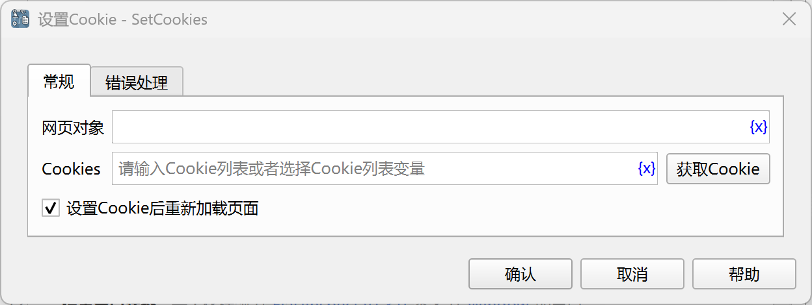

# 设置Cookie

设置网页Cookie。

## 指令配置



### 网页对象

选择要设置Cookie的网页对象。

### Cookies

可以输入由Cookie字典对象组成的列表，或者点击“获取Cookie按钮”调用工具获取，详情请参考[网页Cookie工具](../../../manual/web_cookie_tool.md)。

每个Cookie字典对象包含以下字段：

* name：Cookie名称
* value：Cookie值
* domain：指定 Cookie 所属的域名，控制在哪些域名下可以访问该 Cookie。通常，Cookie 的 domain 会设置为当前访问的网站的域名（例如 example.com）。如果在域名前面加上“.”，如设置为 .example.com，则该域名以及它的所有子域（如 sub.example.com）都可以访问该 Cookie。
* path：指定 Cookie 所属的路径，控制在指定路径及其子路径下才会发送 Cookie。比如，将 path 设置为 /products，则只有访问 /products 及其子路径（如 /products/shoes）时，Cookie 才会被发送。
* expires：Cookie 过期时间，取值格式“yyyy-MM-ddTHH:mm:ss.zzz”+时区，如“2024-11-12T06:36:09.612Z”表示UTC时间“2024-11-12 06:36:09.612”，最后的612是毫秒。“2024-11-12T14:36:09.612+08:00”表示上海时间“2024-11-12 14:36:09.612”。这两个时间是同一个时刻，只不过时区不一样而已。如果不指定，则Cookie 会在浏览器关闭时删除，属于“会话 Cookie”。
* httpOnly：是否仅HTTP访问，设置为 true 后，Cookie 只能通过 HTTP/HTTPS 协议传输，无法通过 JavaScript（如 document.cookie）访问。
* secure：设置为 true 后，Cookie 仅在 HTTPS 安全连接下才会被发送。
* sameSite：控制 Cookie 的跨站请求行为，可设置为以下值：
    * Strict：完全禁止第三方网站访问 Cookie，只有在相同站点请求时才会发送 Cookie。
    * Lax：在一定条件下允许跨站请求携带 Cookie，如导航到其他站点时会发送，但通常不包括表单提交和 AJAX 请求。
    * None：允许跨站请求携带 Cookie，但需要搭配 secure 属性。

Cookie示例：
```json
[
  {"name": "abc", "value": "123", "domain": ".example.com", "path": "/"}, 
  {"name": "efg", "value": "456", "domain": ".example.com", "path": "/", "expires": "2024-11-12T06:36:09.612Z", "httpOnly": true, "secure": true, "sameSite": "Strict"}
]
```

### 设置Cookie后重新加载页面

设置Cookie后是否重新加载页面，以更新页面内容。

### 错误处理

如果指令执行出错，则执行错误处理，详情参见[指令的错误处理](../../../manual/error_handling.md)。
