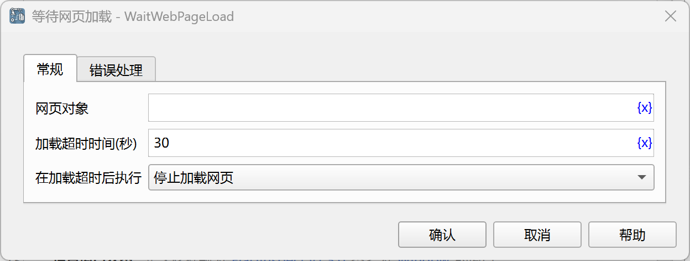

# 等待网页加载

等待网页加载完成，然后再执行后续指令。

## 指令配置

### 网页对象

选择要等待的网页对象。

### 加载超时时间

等待页面加载完成的超时时间，单位为秒。

### 在加载超时后执行

加载超时之后的处理方法，可以停止加载网页，也可以执行错误处理。

### 错误处理

如果加载超时，或者指令执行出错，则执行错误处理，详情参见[指令的错误处理](../../../manual/error_handling.md)。
