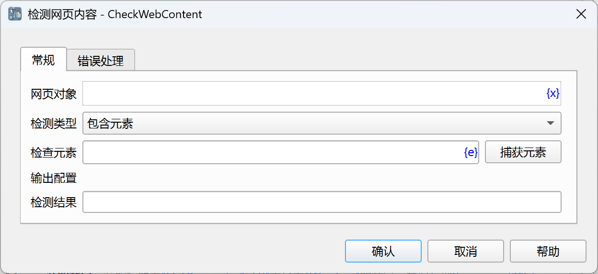

# 检测网页内容

检测网页内容是否满足指定条件，并将检测结果保存到流程变量中。

## 指令配置

### 网页对象

输入网页对象变量。

### 检测类型

检测类型，可以选择：包含元素、不包含元素、包含文本、不包含文本、元素可见、元素不可见、文本可见、文本不可见。

### 检测元素

从元素库中选择一个网页元素，或者点击“捕获元素”按钮调用工具获取，详情请参见[网页元素捕获工具](../../manual/web_element_capture_tool.md)。

### 检测文本

要检测的文本内容。

### 检测结果

输入用于保存检测结果的流程变量名称，该结果是一个布尔变量，如果满足条件，则该值为true，否则为false。

### 错误处理

如果指令执行出错，则执行错误处理，详情参见[指令的错误处理](../../manual/error_handling.md)。
