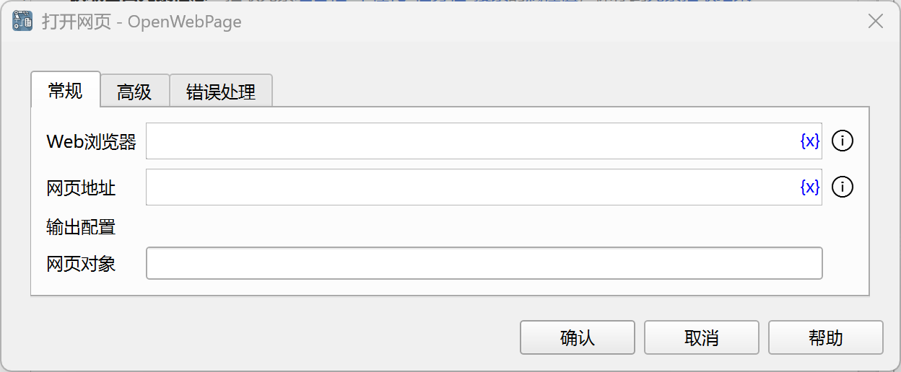
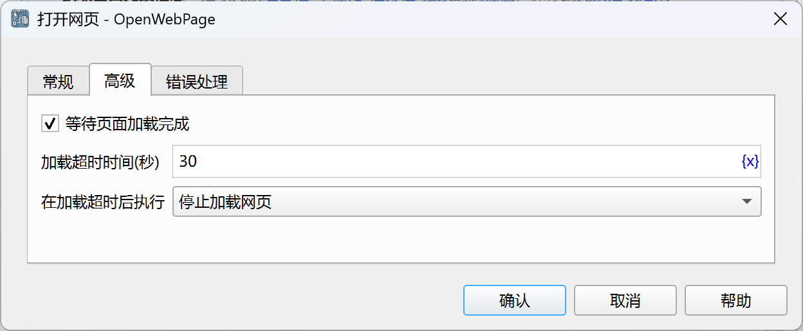

# 打开网页

打开指定的网页。

## 指令配置

### Web浏览器

选择要在哪个Web浏览器中打开网页。

### 网页地址

输入需要打开的网页地址。

### 网页对象

输入用于保存网页对象的流程变量名称。

### 等待页面加载完成

选择是否等待页面加载完成。

### 加载超时时间

设置页面加载超时时间，单位为秒。

### 在加载超时后执行

设置在加载超时后执行的操作：

- 停止加载网页
- 执行错误处理

### 错误处理

如果指令执行出错，则执行错误处理，详情参见[指令的错误处理](../../manual/error_handling.md)。
