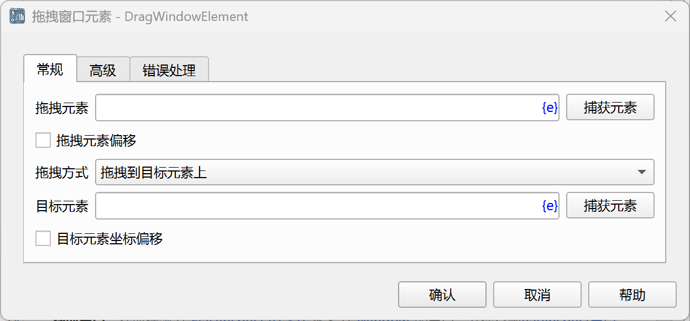
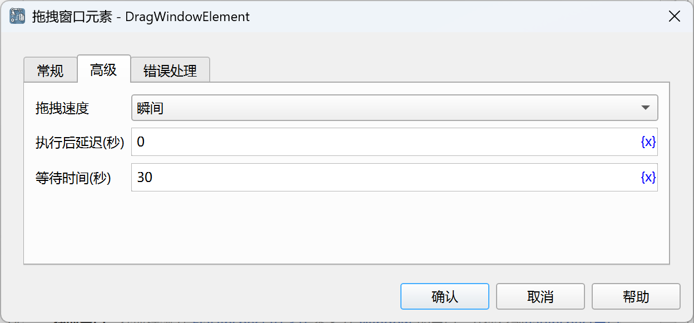

# 拖拽窗口元素

模拟鼠标拖拽窗口元素操作。

## 指令配置

### 拖拽元素

从元素库中选择一个窗口元素，或者点击“捕获元素”按钮调用工具获取，详情请参考[窗口元素捕获工具](../../../manual/window_element_capture_tool.md)。

### 拖拽元素偏移

默认鼠标起始位置为元素中心，如果勾选，则可以设置起始位置相对于元素左上角的偏移量。

### 拖拽元素X坐标偏移

鼠标起始位置相对于元素左上角的X轴偏移量，单位为像素。如果为0，则默认偏移到元素中心。

### 拖拽元素Y坐标偏移

鼠标起始位置相对于元素左上角的Y轴偏移量，单位为像素。如果为0，则默认偏移到元素中心。

### 拖拽方式

选择拖拽方式，可选值有：拖拽到目标元素上、拖拽指定的偏移量。

### 目标元素

从元素库中选择一个窗口元素，或者点击“捕获元素”按钮调用工具获取，详情请参考[窗口元素捕获工具](../../../manual/window_element_capture_tool.md)。

### 目标元素坐标偏移

拖拽到目标元素上时，默认鼠标结束位置为目标元素中心，如果勾选，则可以设置结束位置相对于目标元素左上角的偏移量。

### 目标元素X坐标偏移

鼠标结束位置相对于目标元素左上角的X轴偏移量，单位为像素。如果为0，则默认偏移到元素中心。

### 目标元素Y坐标偏移

鼠标结束位置相对于目标元素左上角的Y轴偏移量，单位为像素。如果为0，则默认偏移到元素中心。

### 拖拽X坐标偏移

拖拽方式选择拖拽指定的偏移量时，输入鼠标结束位置相对于起始位置的X轴偏移量，单位为像素。

### 拖拽Y坐标偏移

鼠标结束位置相对于起始位置的Y轴偏移量，单位为像素。

### 拖拽速度

选择拖拽速度，可选值有：瞬间、快速、中速、慢速。

### 等待时间

等待网页元素出现的时间，单位为秒。

### 错误处理

如果指令执行出错，则执行错误处理，详情参见[指令的错误处理](../../../manual/error_handling.md)。
