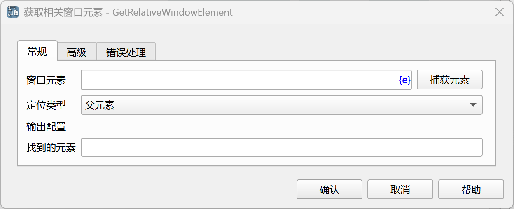
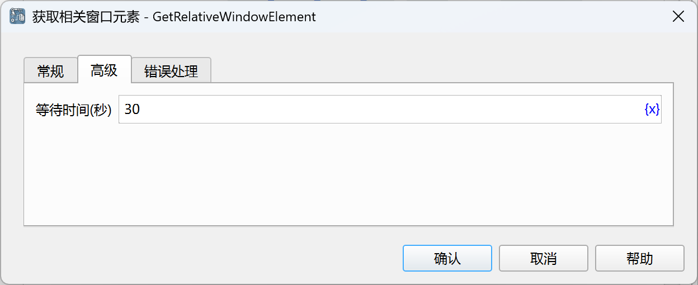

# 获取相关窗口元素

获取指定窗口元素的相关元素。

## 指令配置

### 窗口元素

从元素库中选择一个窗口元素，或者点击“捕获元素”按钮调用工具获取，详情请参考[窗口元素捕获工具](../../../manual/window_element_capture_tool.md)。

### 定位类型

选择相关元素定位类型，可选值有：父元素、上一个兄弟元素、下一个兄弟元素、第一个匹配的子孙元素、所有匹配的子孙元素、所有子元素、指定位置的子元素。

### 子孙元素相对xpath

如果定位类型选择第一个匹配的子孙元素或所有匹配的子孙元素，则需要输入用于匹配子孙元素的相对xpath。

除了手动输入xpath，还可以点击“获取相对XPath”按钮，调用工具获取，详情请参考[窗口元素相对XPath工具](../../../manual/window_element_relative_xpath_tool.md)。

### 子元素位置

如果定位类型选择指定位置的子元素，则需要输入要定位的元素在父元素中的位置，从0开始。

### 找到的元素

输入用于保存找到的元素或元素列表的流程变量。

### 等待时间

等待指定网页元素出现的时间，单位为秒。

### 错误处理

如果指令执行出错，则执行错误处理，详情参见[指令的错误处理](../../../manual/error_handling.md)。
