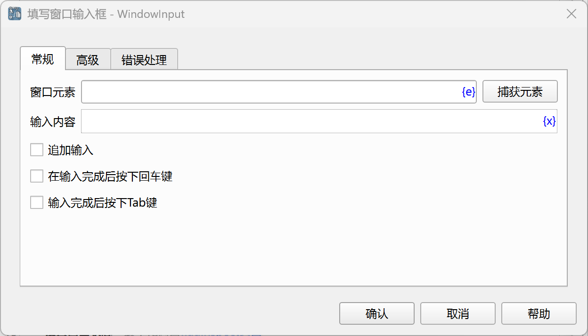
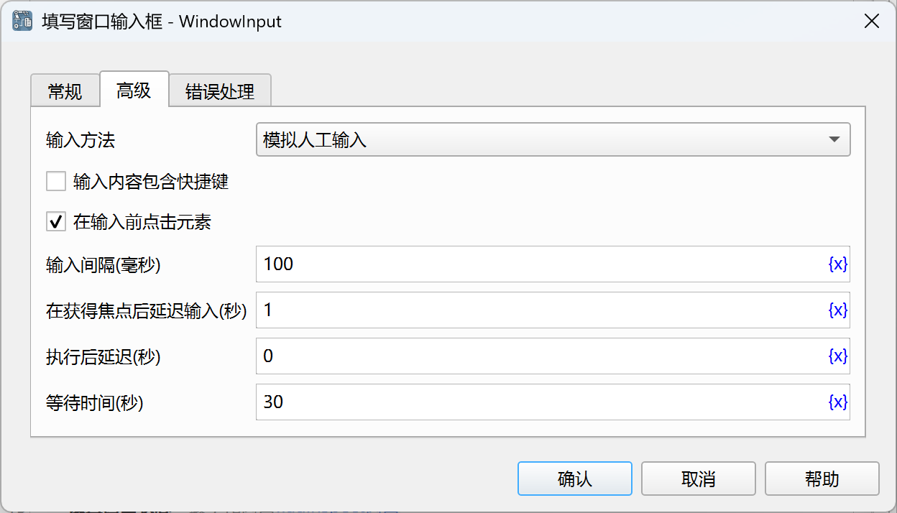

# 填写窗口输入框

填写窗口中的输入框。

## 指令配置

### 窗口元素

从元素库中选择一个输入框元素，或者点击“捕获元素”按钮调用工具获取，详情请参考[窗口元素捕获工具](../../../manual/window_element_capture_tool.md)。

### 输入内容

输入要填写的内容。

### 追加输入

如果勾选，则在原有输入内容上追加输入内容，否则，则覆盖原有输入内容。

### 在输入完成后按下回车键

如果勾选，则在输入完成后，再按下回车键。

### 输入完成后按下Tab键

如果勾选，则在输入完成后，再按下Tab键。

### 输入方法

选择输入方法：
* 模拟人工输入：模拟人工输入方式。
* 自动化接口输入：调用自动化接口输入。

### 输入内容是否包含快捷键

如果勾选，则可以在输入内容中包含快捷键。

可用的虚拟按键如下：

    {SCROLLLOCK}, {VK_SPACE}, {VK_LSHIFT}, {VK_PAUSE}, {VK_MODECHANGE},
    {BACK}, {VK_HOME}, {F23}, {F22}, {F21}, {F20}, {VK_HANGEUL}, {VK_KANJI},
    {VK_RIGHT}, {BS}, {HOME}, {VK_F4}, {VK_ACCEPT}, {VK_F18}, {VK_SNAPSHOT},
    {VK_PA1}, {VK_NONAME}, {VK_LCONTROL}, {ZOOM}, {VK_ATTN}, {VK_F10}, {VK_F22},
    {VK_F23}, {VK_F20}, {VK_F21}, {VK_SCROLL}, {TAB}, {VK_F11}, {VK_END},
    {LEFT}, {VK_UP}, {NUMLOCK}, {VK_APPS}, {PGUP}, {VK_F8}, {VK_CONTROL},
    {VK_LEFT}, {PRTSC}, {VK_NUMPAD4}, {CAPSLOCK}, {VK_CONVERT}, {VK_PROCESSKEY},
    {ENTER}, {VK_SEPARATOR}, {VK_RWIN}, {VK_LMENU}, {VK_NEXT}, {F1}, {F2},
    {F3}, {F4}, {F5}, {F6}, {F7}, {F8}, {F9}, {VK_ADD}, {VK_RCONTROL},
    {VK_RETURN}, {BREAK}, {VK_NUMPAD9}, {VK_NUMPAD8}, {RWIN}, {VK_KANA},
    {PGDN}, {VK_NUMPAD3}, {DEL}, {VK_NUMPAD1}, {VK_NUMPAD0}, {VK_NUMPAD7},
    {VK_NUMPAD6}, {VK_NUMPAD5}, {DELETE}, {VK_PRIOR}, {VK_SUBTRACT}, {HELP},
    {VK_PRINT}, {VK_BACK}, {CAP}, {VK_RBUTTON}, {VK_RSHIFT}, {VK_LWIN}, {DOWN},
    {VK_HELP}, {VK_NONCONVERT}, {BACKSPACE}, {VK_SELECT}, {VK_TAB}, {VK_HANJA},
    {VK_NUMPAD2}, {INSERT}, {VK_F9}, {VK_DECIMAL}, {VK_FINAL}, {VK_EXSEL},
    {RMENU}, {VK_F3}, {VK_F2}, {VK_F1}, {VK_F7}, {VK_F6}, {VK_F5}, {VK_CRSEL},
    {VK_SHIFT}, {VK_EREOF}, {VK_CANCEL}, {VK_DELETE}, {VK_HANGUL}, {VK_MBUTTON},
    {VK_NUMLOCK}, {VK_CLEAR}, {END}, {VK_MENU}, {SPACE}, {BKSP}, {VK_INSERT},
    {F18}, {F19}, {ESC}, {VK_MULTIPLY}, {F12}, {F13}, {F10}, {F11}, {F16},
    {F17}, {F14}, {F15}, {F24}, {RIGHT}, {VK_F24}, {VK_CAPITAL}, {VK_LBUTTON},
    {VK_OEM_CLEAR}, {VK_ESCAPE}, {UP}, {VK_DIVIDE}, {INS}, {VK_JUNJA},
    {VK_F19}, {VK_EXECUTE}, {VK_PLAY}, {VK_RMENU}, {VK_F13}, {VK_F12}, {LWIN},
    {VK_DOWN}, {VK_F17}, {VK_F16}, {VK_F15}, {VK_F14}
    
    ~ 是 {ENTER} 的别名。

修改键：

* '+' 代表 {VK_SHIFT} 键，即Shift键
* '^' 代表 {VK_CONTROL} 键，即Ctrl键
* '%' 代表 {VK_MENU} 键，即Alt键

使用这些修改键的示例：

* '^a^c'：输入Ctrl+A和Ctrl+C快捷键。
* '+{INS}'：输入Shift+Ins快捷键。
* '%{F4}'：输入Alt+F4快捷键。

另外可以为按键指定重复次数，如'{ENTER 2}'表示连续按两次回车键。

还可以为按键指定按下或释放操作，如'{VK_SHIFT down}'表示按下Shift键，'{VK_SHIFT up}'表示释放Shift键。

如果要将特殊字符作为普通字符输入，则需要使用大括号进行转移。
如'{^}a{^}c{%}'将会输入内容'^a^c%'，而不会按下Ctrl键和Alt键。
'{{}ENTER{}}'将会输入内容'{ENTER}'，而不会按下Enter键。

### 在输入前点击元素

如果勾选，则在输入前，先点击指定的元素。

### 输入间隔

输入之间的时间间隔，单位为毫秒。

### 在获得焦点后延迟输入

在获得焦点后，延迟一段时间再输入，单位为秒。

### 执行后延迟

执行指令后，延迟一段时间再继续执行后续指令，单位为秒。

### 等待时间

等待输入框出现的时间，单位为秒。

### 错误处理

如果指令执行出错，则执行错误处理，详情参见[指令的错误处理](../../../manual/error_handling.md)。
