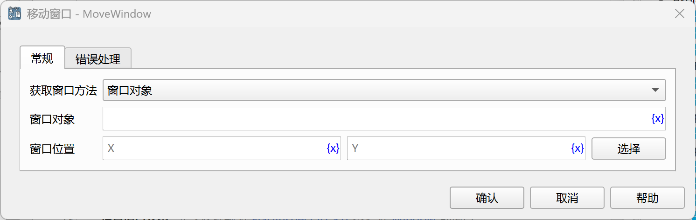

# 移动窗口

移动指定的窗口。

## 指令配置

### 获取窗口方法

选择获取窗口的方法：

* 窗口对象：移动选择的窗口对象。
* 窗口标题或类名：移动指定标题或类名的窗口。
* 捕获窗口元素：移动窗口元素所在的窗口。

### 窗口对象

从流程变量中选择一个窗口对象。

### 窗口标题

输入窗口标题，也可以点击“选择”按钮从当前打开的所有桌面窗口中选择一个窗口的标题。

### 使用窗口类名

如果勾选该选项，则同时使用窗口类名作为匹配条件。

### 窗口类名

输入窗口类名，也可以点击“选择”按钮从当前打开的所有桌面窗口中选择一个窗口的类名。

### 使用正则表达式匹配

如果勾选该选项，则将窗口标题作为正则表达式进行匹配。

### 窗口元素

从元素库中选择一个窗口元素，或者点击“捕获元素”按钮调用工具获取，详情请参考[窗口元素捕获工具](../../../manual/window_element_capture_tool.md)。

### 窗口位置

输入窗口位置，或者点击“选择”按钮从当前打开的所有桌面窗口中选择一个窗口的位置。

### 错误处理

如果未找到网页，或者指令执行出错，则执行错误处理，详情参见[指令的错误处理](../../../manual/error_handling.md)。
