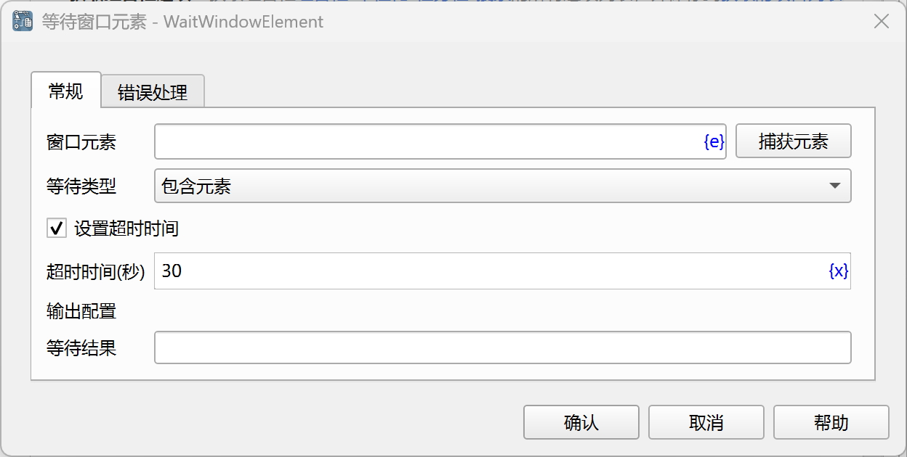

# 等待窗口元素

等待窗口元素满足指定条件，然后执行后续指令。

## 指令配置

### 窗口元素

从元素库中选择一个窗口元素，或者点击“捕获元素”按钮调用工具获取，详情请参考[窗口元素捕获工具](../../manual/window_element_capture_tool.md)。

### 等待类型

等待类型，可以选择：包含元素、不包含元素。

### 设置超市时间

如果勾选该选项，则等待元素满足指定的条件直到超时，否则，立即返回等待结果。

### 等待时间

等待窗口元素满足指定条件的超时时间，单位为秒。

### 等待结果

输入用于保存等待结果的流程变量名称，该结果是一个布尔变量，如果满足条件，则该值为true，如果不满足条件或者超时则为false。

### 错误处理

如果等待超时，或者指令执行出错，则执行错误处理，详情参见[指令的错误处理](../../manual/error_handling.md)。
