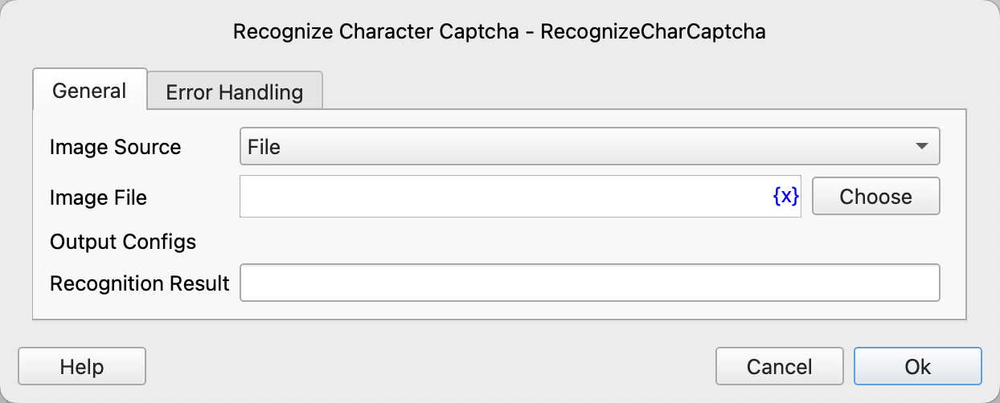
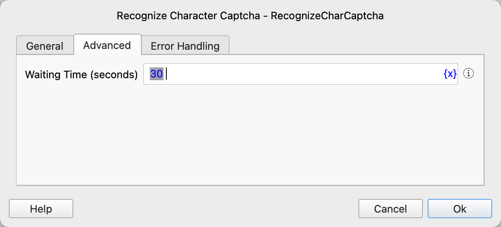

# Recognize Character Captcha

Recognize character captcha in images, web pages, or windows, and return the recognition result.

## Instruction Configuration

### Image Source

Select the source of the captcha image. Options: File, Web Element, Window Element.

### Image File

When the image source is "File", input the path to the captcha image file.

### Web Page Object

When the image source is "Web Element", select the web page object containing the captcha.

### Web Element

When the image source is "Web Element", select a web element from the element library, or click the "Capture Element" button to use the tool. See [Web Element Capture Tool](../../../manual/web_element_capture_tool.md) for details.

### Window Element

When the image source is "Window Element", select the window element containing the captcha image.

### Wait Time

The time to wait for the web element or window element to appear, in seconds.

### Recognition Result

Input the variable name to save the recognition result.

### Error Handling

If the instruction execution fails, execute error handling. See [Instruction Error Handling](../../../manual/error_handling.md) for details.

## Notes

1. This instruction uses the ddddocr library for captcha recognition. It has a high recognition rate for simple character captchas, but may not perform well on complex captchas (e.g., severely distorted, with interference lines, complex backgrounds, etc.).

2. When the image source is a web element or window element, the instruction will first capture the element image and then perform recognition. Ensure the selected element correctly contains the complete captcha image.

3. The wait time parameter is only valid when the image source is a web element or window element, used to wait for the element to appear. If the element does not appear within the specified time, an exception will be thrown.

4. If recognition fails or the input parameters are incorrect, the instruction will throw an exception. You can use the error handling mechanism to catch and handle these exceptions.
