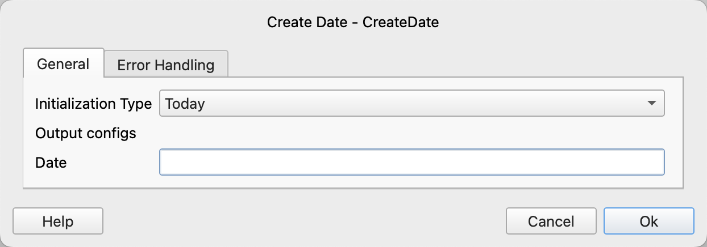

# Create Date

Create a date variable and initialize it with a specified value.

## Instruction Configuration

### Initialization Type

Select the initialization type, available options are: Today, Convert timestamp to date, Parse date string.

### Timestamp

If the initialization type is Convert Timestamp to Date, enter the timestamp.

A timestamp is the number of seconds from January 1, 1970 00:00:00 UTC to the current time, supporting decimals where the decimal part represents milliseconds.

### Date String

If the initialization type is Parse Date String, enter the date string.

### Date Format

If the initialization type is Parse Date String, enter the date and time format.

For more information on date formats, please refer to [Date Time Format](create_date_time.md#_6)

### Date

Enter the variable name to save the date.
