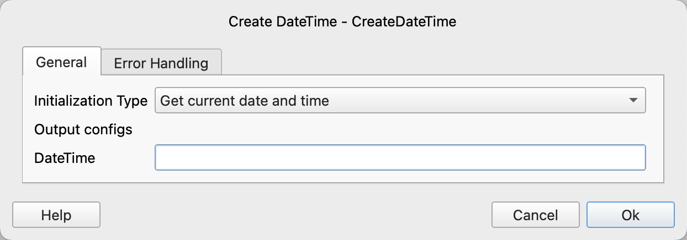

# Create DateTime

Create a datetime variable and initialize it with a specified value.

## Instruction Configuration

### Initialization Type

Select the initialization type. Available options are: Get current date and time, Convert timestamp to datetime, Parse datetime string.

### Timestamp

If the initialization type is Convert Timestamp to DateTime, input the timestamp.

A timestamp is the number of seconds from January 1, 1970 00:00:00 UTC to the current time. It supports decimals, where the decimal part represents milliseconds.

### DateTime String

If the initialization type is Parse DateTime String, input the datetime string.

### DateTime Format

If the initialization type is Parse DateTime String, input the datetime format.

A datetime format string is a string composed of format symbols and regular characters, used to parse or generate datetime strings.

Examples of datetime formats:

| Format String                  | Example Matches                                           |
|:-------------------------------|:---------------------------------------------------------|
| YYYY-MM-DD HH:mm:ss            | 2024-11-13 21:01:45                                      |
| YYYY-MM-DDTHH:mm:ss.SSSZZ      | 2024-11-13T13:01:45.512Z, 2024-11-13T21:01:45.512+08:00  |
| YYYY-MM-DD HH:mm:ssZZ          | 2024-11-13 13:01:45Z, 2024-11-13 21:01:45+08:00          |

Supported format symbols are as follows:

|                | Symbol | Output                                      |
|:---------------|:-------|:-------------------------------------------|
| **Year**       | YYYY   | 2000, 2001, 2002 ... 2012, 2013            |
|                | YY     | 00, 01, 02 ... 12, 13                      |
| **Month**      | MMMM   | January, February, March ...               |
|                | MMM    | Jan, Feb, Mar ...                          |
|                | MM     | 01, 02, 03 ... 11, 12                      |
|                | M      | 1, 2, 3 ... 11, 12                         |
| **Day of Year**| DDDD   | 001, 002, 003 ... 364, 365                 |
|                | DDD    | 1, 2, 3 ... 364, 365                       |
| **Day**        | DD     | 01, 02, 03 ... 30, 31                      |
|                | D      | 1, 2, 3 ... 30, 31                         |
|                | Do     | 1st, 2nd, 3rd ... 30th, 31st               |
| **Day of Week**| dddd   | Monday, Tuesday, Wednesday ...             |
|                | ddd    | Mon, Tue, Wed ...                          |
|                | d      | 1, 2, 3 ... 6, 7                           |
| **ISO Week Date**| W     | 2011-W05-4, 2019-W17                       |
| **Hour**       | HH     | 00, 01, 02 ... 23, 24                      |
|                | H      | 0, 1, 2 ... 23, 24                         |
|                | hh     | 01, 02, 03 ... 11, 12                      |
|                | h      | 1, 2, 3 ... 11, 12                         |
| **AM / PM**    | A      | AM, PM, am, pm                             |
|                | a      | am, pm                                     |
| **Minute**     | mm     | 00, 01, 02 ... 58, 59                      |
|                | m      | 0, 1, 2 ... 58, 59                         |
| **Second**     | ss     | 00, 01, 02 ... 58, 59                      |
|                | s      | 0, 1, 2 ... 58, 59                         |
| **Subsecond**  | S...   | 0, 02, 003, 000006, 123123123123...        |
| **Timezone**   | ZZZ    | Asia/Baku, Europe/Warsaw, GMT ...          |
|                | ZZ     | -07:00, -06:00 ... +06:00, +07:00, +08, Z  |
|                | Z      | -0700, -0600 ... +0600, +0700, +08, Z      |
| **Timestamp (seconds)** | X | 1381685817, 1381685817.915482 ... |
| **Timestamp (milliseconds or microseconds)** | x | 1569980330813, 1569980330813221 |

If you need to use a format symbol as a regular character, enclose the format symbol in square brackets. For example, "YYYY-MM-DD h [h] m" can be used to match "2024-11-13 8 h 40".

### DateTime

Input the variable name to save the datetime.
