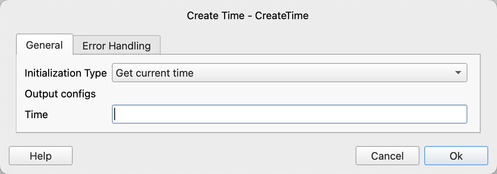

# Create Time

Create a time variable and initialize it to a specified value.

## Instruction Configuration

### Initialization Type

Select the initialization type. The available values are: Get current time, Parse time string.

### Time String

If the initialization type is Parse Time String, enter the time string.

### Time Format

If the initialization type is Parse Time String, enter the time format.

For more information about the time format, please refer to [Date and Time Format](create_date_time.md#_6).

### Time

Enter the variable name used to save the time.
