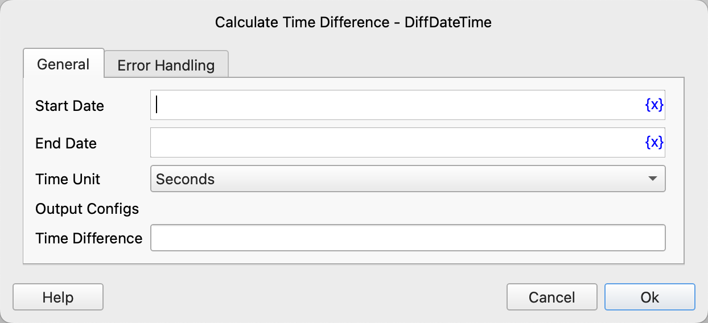

# Calculate Time Difference

Calculate the time difference between two date-time objects.

## Instruction Configuration

### Start Date

Enter the start date and time.

### End Date

Enter the end date and time.

### Time Unit

Select the unit for the time difference. Available options are: seconds, minutes, hours, days.

### Time Difference

Enter the variable name to store the time difference.

The result is an integer. If the start date is before the end date, a positive number is returned; if the start date is after the end date, a negative number is returned; otherwise, 0 is returned.

### Error Handling

If the instruction execution encounters an error, error handling will be performed. For details, refer to [Error Handling for Instructions](../../../manual/error_handling.md).