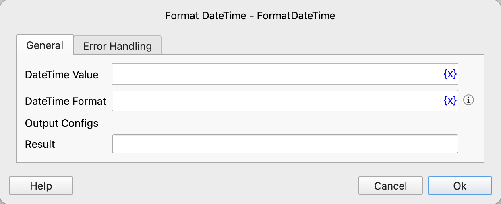

# Format DateTime

Convert a datetime object to a string according to the specified format.

## Instruction Configuration

### DateTime Value
Select the datetime object.

### DateTime Format
Enter the datetime format. For details, see [Date and Time Format](create_date_time.md#_6).

### Result
Enter the variable name used to save the result string.

### Error Handling
If an error occurs during the execution of the instruction, perform error handling. For details, see [Error Handling of Instructions](../../../manual/error_handling.md).
