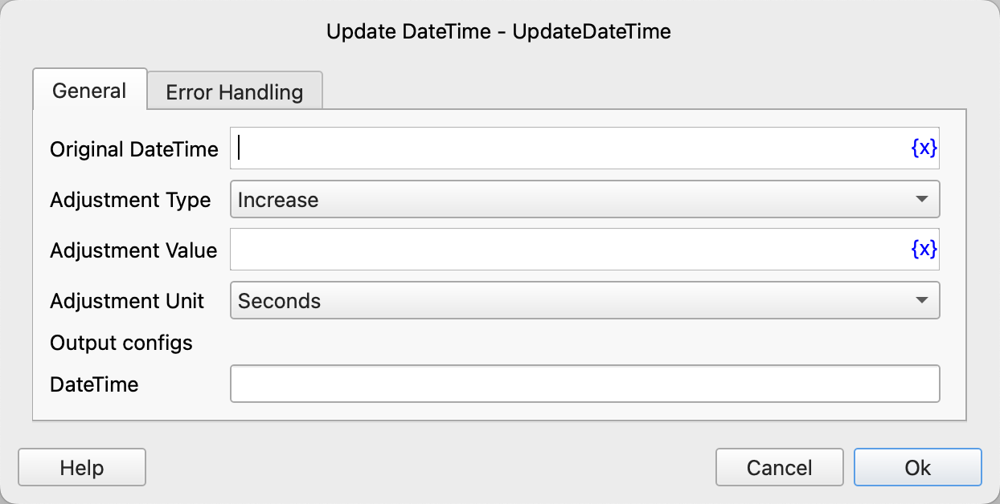

# Update DateTime

Modify the date and time.

## Instruction Configuration

### Original DateTime

Enter the datetime that needs to be modified.

### Adjustment Type

Select the adjustment type. Available options are: Increase, Decrease.

### Adjustment Value

Enter the value to be increased or decreased.

### Adjustment Unit

Select the adjustment unit. Available options are: Microseconds, Milliseconds, Seconds, Minutes, Hours, Days, Weeks, Months, Years.

### DateTime

Enter the variable name to store the adjusted datetime.

### Error Handling

If the instruction execution encounters an error, error handling will be performed. For details, refer to [Error Handling for Instructions](../../../manual/error_handling.md).
