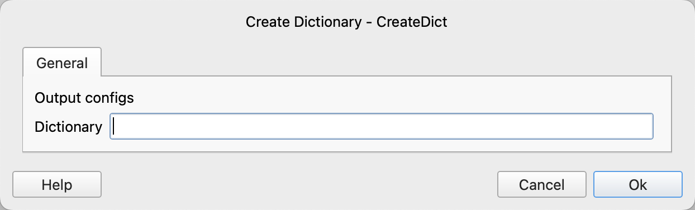

# Create Dictionary

Create an empty dictionary and save the result to the specified variable.

## Instruction Configuration

### Dictionary

Enter the variable name used to save the empty dictionary.