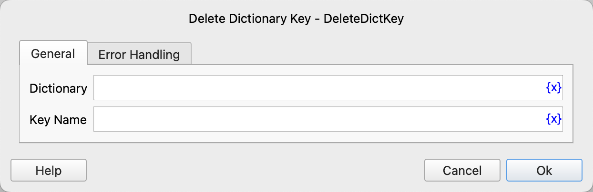

# Delete Dictionary Key

Deletes the specified key from a dictionary object.

## Instruction Configuration

### Dictionary

Select the dictionary object.

### Key Name

Enter the name of the key to be deleted.

### Error Handling

If the instruction execution encounters an error, error handling will be performed. For details, refer to [Error Handling for Instructions](../../../manual/error_handling.md).