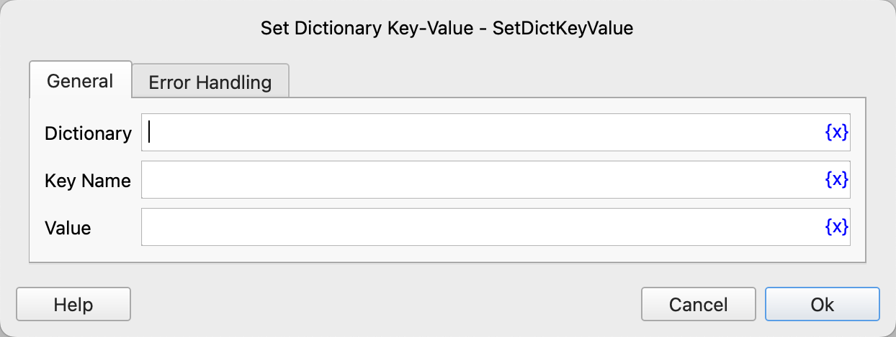

# Set Dictionary Key-Value

Add a key-value pair to a dictionary object.

## Instruction Configuration

### Dictionary

Select the dictionary object.

### Key Name

Enter the key name.

### Value

Enter the key value.

### Error Handling

If the instruction execution encounters an error, error handling will be performed. For details, refer to [Error Handling for Instructions](../../../manual/error_handling.md).