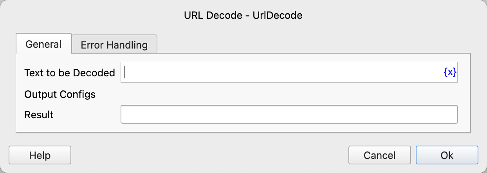

# URL Decode

Decode the text in URL format.

## Instruction Configuration

### Text to be Decoded

Enter the text to be decoded.

### Result

Enter the variable name used to save the decoded text result.

### Error Handling

If an error occurs during the execution of the instruction, perform error handling. For details, see [Error Handling of Instructions](../../../manual/error_handling.md). 
