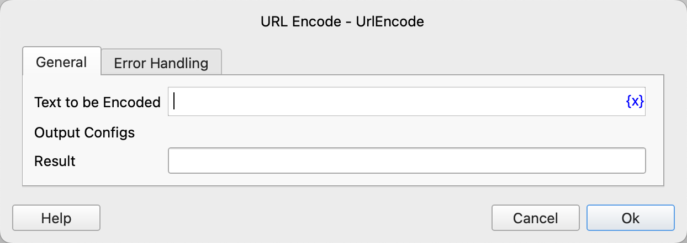

# URL Encode

Perform URL encoding on text.

## Instruction Configuration

### Text to be Encoded

Enter the text to be encoded.

### Result

Enter the variable name used to save the encoded text result.

### Error Handling

If an error occurs during the execution of the instruction, perform error handling. For details, see [Error Handling of Instructions](../../../manual/error_handling.md).
