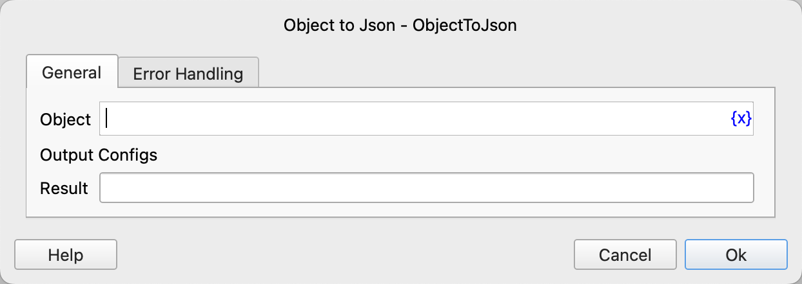

# Object to Json

Convert a process object to Json text.

## Instruction Configuration

### Object

Input the process object to be converted. Currently, only dictionaries, lists, text, numbers, boolean values, and null values are supported.

### Result

Input the variable name to save the conversion result.

### Error Handling

If the instruction execution encounters an error, error handling will be performed. For details, refer to [Error Handling for Instructions](../../../manual/error_handling.md).
